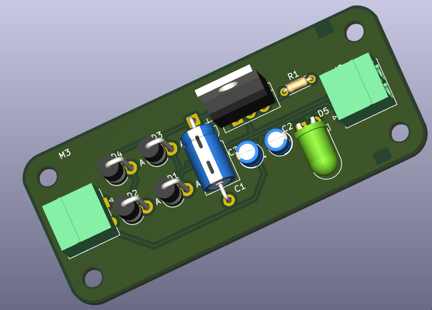
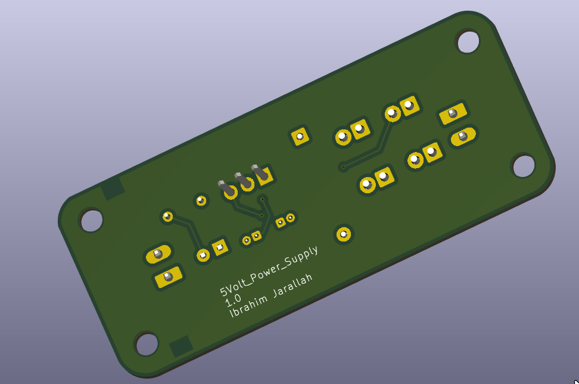
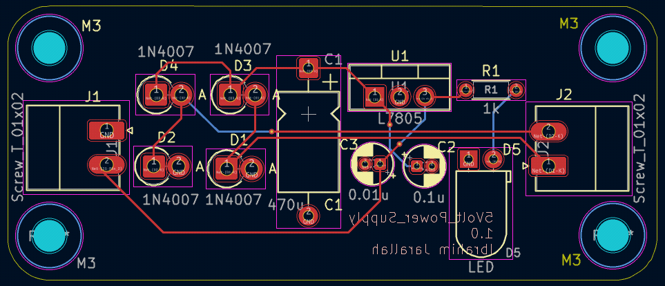
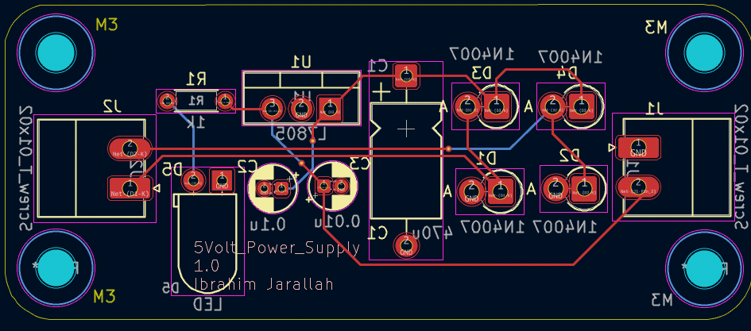
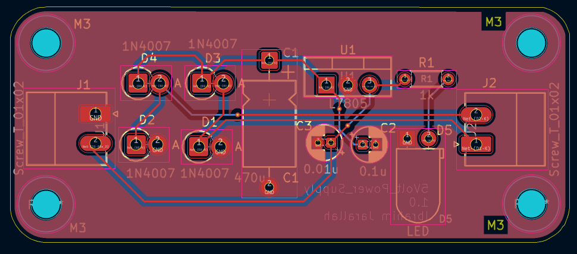
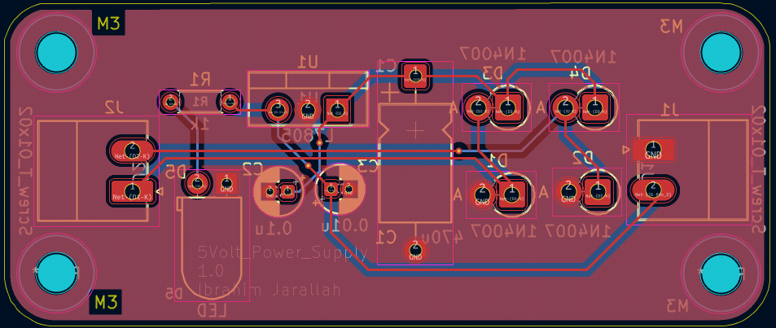
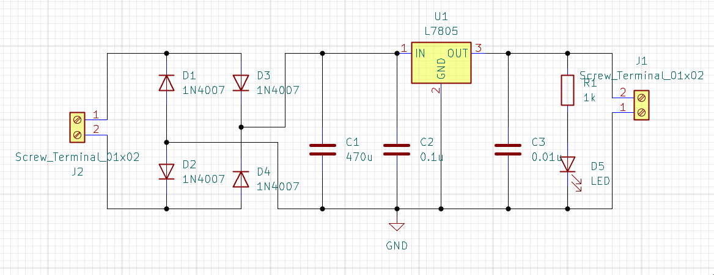

# 5V Regulated Power Supply — L7805 Based PCB

> A classic linear regulated 5V power supply built around the L7805 voltage regulator.  
> Full-wave bridge rectifier input, multi-stage filtering, and power LED indicator.  
> Designed and laid out in **KiCad 9.0** — schematic + 2-layer PCB with full fabrication outputs.

---

## 📸 3D Views

| Front | Back |
|:---:|:---:|
|  |  |

## 🖼️ PCB Layout (2D)

| Front | Back |
|:---:|:---:|
|  |  |

## 🟤 PCB Layout — Copper Fill (2D)

| Front | Back |
|:---:|:---:|
|  |  |

## 📐 Schematic



---

## ⚡ Specifications

| Parameter             | Value                              |
|-----------------------|------------------------------------|
| Input Voltage (AC)    | 9V AC (transformer secondary)      |
| Rectified DC (unregulated) | ~12.7V DC                   |
| Output Voltage        | 5V DC regulated                    |
| Max Output Current    | 500mA continuous (no heatsink)     |
| Regulator             | L7805 (TO-220)                     |
| Rectifier             | Full-wave bridge — 4× 1N4007       |
| Bulk Capacitance      | 470µF                              |
| PCB Layers            | 2                                  |
| Designed With         | KiCad 9.0.7                        |

---

## 🔧 How It Works

### 1. Rectification
Four **1N4007** diodes arranged in a **full-wave bridge** configuration convert the 9V AC transformer secondary into pulsating DC (~12.7V peak).

### 2. Filtering
A three-stage capacitor filter smooths the rectified DC:
- **C1 (470µF)** — bulk electrolytic, handles low-frequency ripple
- **C2 (0.1µF)** — bypass capacitor, mid-frequency noise suppression
- **C3 (0.01µF)** — high-frequency decoupling at the regulator input

### 3. Regulation
The **L7805** linear regulator drops the unregulated ~12.7V down to a stable **5V DC output**, regardless of load variations up to 500mA.

### 4. Power Indicator
**D5 (LED)** with **R1 (1kΩ)** current-limiting resistor provides a visual power-on indication.  
LED current ≈ (5V − 2V) / 1kΩ ≈ **3mA**.

### 5. Connectors
Two **Phoenix Contact screw terminals (J1, J2)** — 3.5mm pitch — for robust AC input and DC output connections.

---

## 📦 Bill of Materials

| ID | Designator | Description | Quantity | Footprint |
|----|------------|-------------|----------|-----------|
| 1 | U1 | L7805 Voltage Regulator | 1 | TO-220-3 Vertical |
| 2 | D1–D4 | Diode 1N4007 (Bridge Rectifier) | 4 | DO-15 P2.54mm Vertical AnodeUp |
| 3 | D5 | LED 5mm | 1 | LED D5.0mm Horizontal |
| 4 | C1 | Capacitor 470µF electrolytic | 1 | Axial L10.0mm D6.0mm P15.00mm |
| 5 | C2 | Capacitor 0.1µF | 1 | Radial D4.0mm P1.50mm |
| 6 | C3 | Capacitor 0.01µF | 1 | Radial D4.0mm P1.50mm |
| 7 | R1 | Resistor 1kΩ | 1 | Axial DIN0204 L3.6mm P5.08mm |
| 8 | J1, J2 | Screw Terminal 2-pin 3.5mm | 2 | PhoenixContact MC 1.5/2-G-3.5 |

---

## 📁 Repository Structure

```
5Volt_Power_Supply/
├── 5Volt_Power_Supply.kicad_pro     # KiCad project file
├── 5Volt_Power_Supply.kicad_sch     # Schematic
├── 5Volt_Power_Supply.kicad_pcb     # PCB layout
├── BOM/
│   └── 5Volt_Power_Supply.csv       # Bill of materials
├── netlist/
│   └── 5Volt_Power_Supply.net       # Netlist
├── gerbers/                         # Fabrication Gerber files
│   ├── 5Volt_Power_Supply-F_Cu.gbr
│   ├── 5Volt_Power_Supply-B_Cu.gbr
│   ├── 5Volt_Power_Supply-F_Mask.gbr
│   ├── 5Volt_Power_Supply-B_Mask.gbr
│   ├── 5Volt_Power_Supply-F_Silkscreen.gbr
│   ├── 5Volt_Power_Supply-B_Silkscreen.gbr
│   ├── 5Volt_Power_Supply-F_Paste.gbr
│   ├── 5Volt_Power_Supply-B_Paste.gbr
│   ├── 5Volt_Power_Supply-Edge_Cuts.gbr
│   └── 5Volt_Power_Supply-job.gbrjob
├── drills/
│   ├── 5Volt_Power_Supply-PTH.drl   # Plated through-holes
│   └── 5Volt_Power_Supply-NPTH.drl  # Non-plated through-holes
├── 3D_VIEW/
│   ├── front_3d.png
│   └── back_3d.png
├── 2D_VIEW/
│   ├── 2d_view_front.png
│   ├── 2d_view_back.png
│   ├── 2d_view_front_filled.png
│   └── 2d_view_back_filled.png
└── Schematic_view/
    └── schematic_view.png
```

---

## 🖥️ Opening the Project

1. Install [KiCad 9.0+](https://www.kicad.org/download/)
2. Clone this repository:
   ```bash
   git clone https://github.com/ibrahimjarallah/5Volt_Power_Supply.git
   ```
3. Open `5Volt_Power_Supply.kicad_pro` in KiCad

---

## 🏭 Fabrication

All fabrication outputs are ready in the `gerbers/` and `drills/` folders.  
Compatible with standard PCB manufacturers (JLCPCB, PCBWay, OSHPark, etc.).

- Load `5Volt_Power_Supply-job.gbrjob` directly into any Gerber viewer or fab upload portal
- Drill files: `PTH` (plated) and `NPTH` (non-plated) provided separately

---

## ⚠️ Notes

- **No heatsink** — keep output current below 500mA to avoid thermal shutdown of L7805
- **Transformer not included** — requires external 9VAC center-tapped or standard secondary transformer
- **Polarized capacitors** — observe correct polarity for C1 during assembly

---

## 📄 License

This project is licensed under the **MIT License**.  
You are free to use, modify, and distribute it with attribution.

---

## 👤 Author

**Ibrahim Jarallah**  
GitHub: [ibrahimjarallah](https://github.com/ibrahimjarallah) \
LinkedIn: [ibrahimjarallah](https://www.linkedin.com/in/ibrahim-jarallah)
